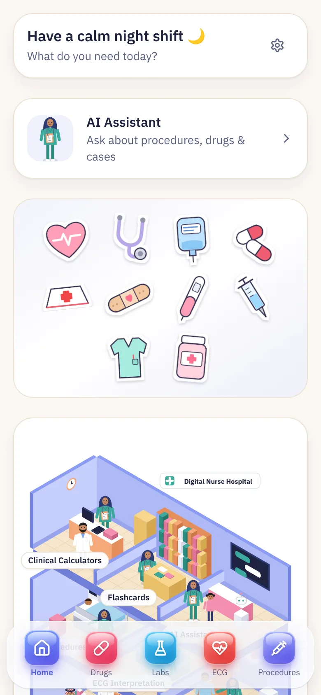
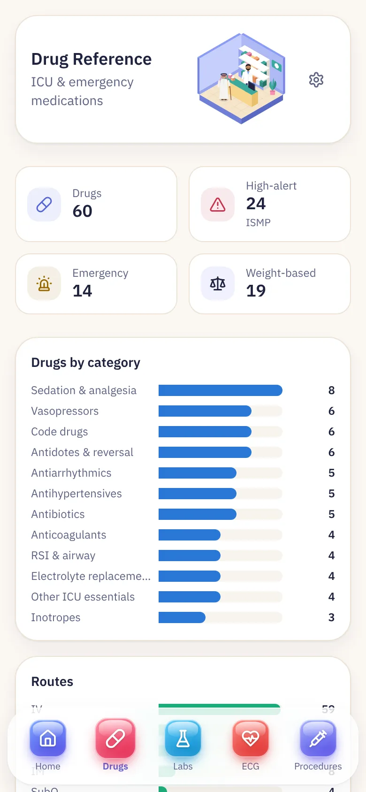
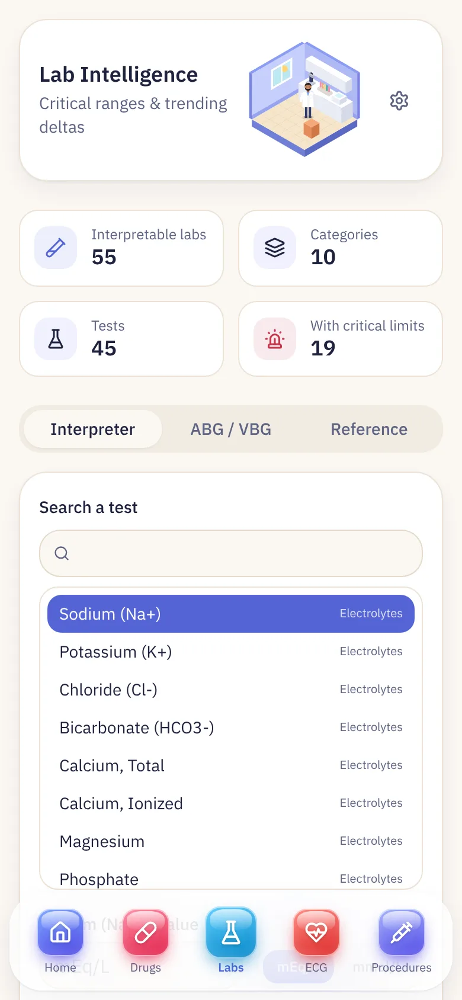
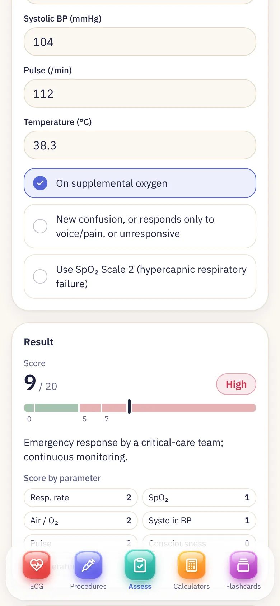
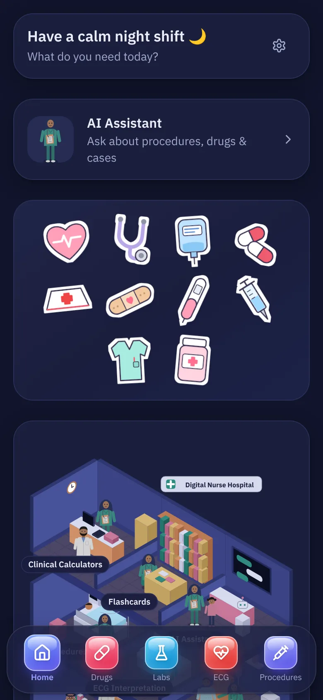
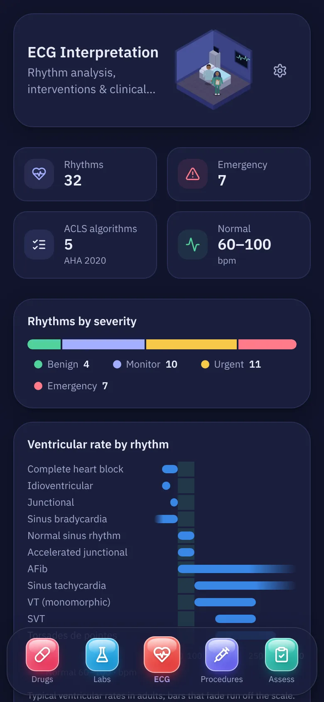
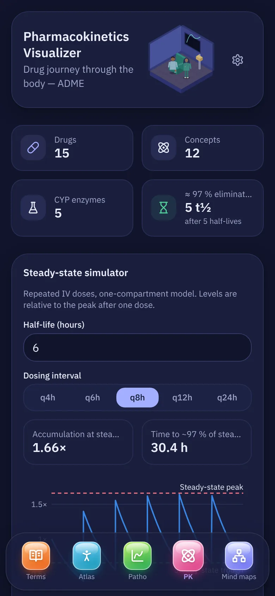
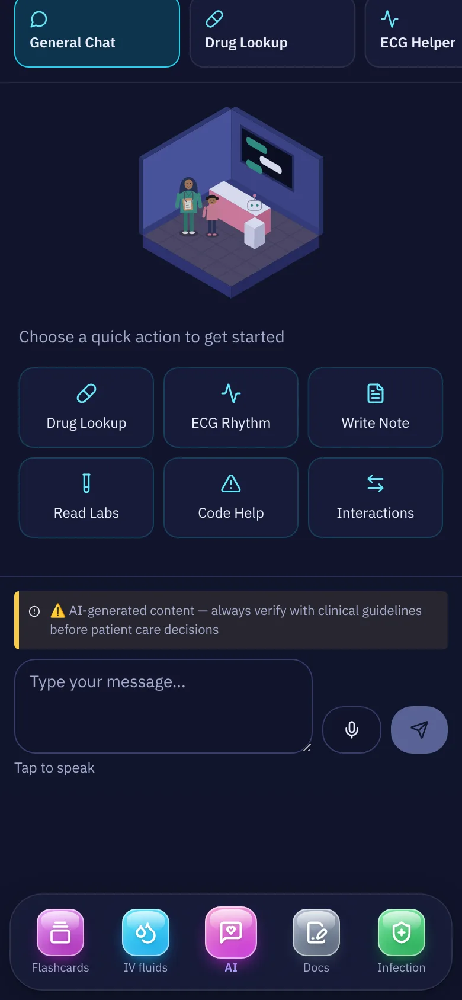
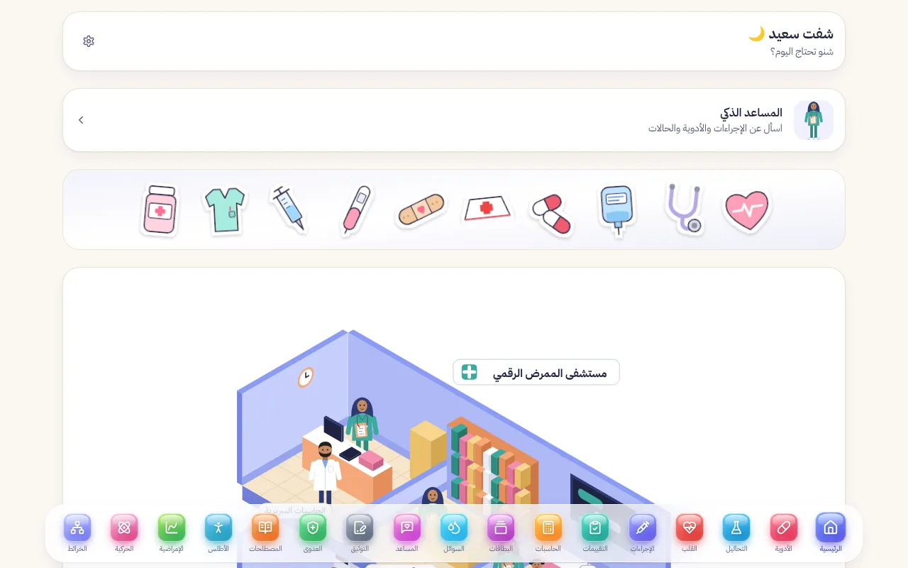

<p align="center">
  
</p>

<h1 align="center">Digital Nurse Buddy · الممرض الرقمي</h1>

<p align="center">
  <strong>A bilingual clinical reference for bedside nurses — built by an ICU nurse, for nurses.</strong><br/>
  <sub>مرجع سريري ثنائي اللغة للممرضين بجانب السرير — صممه ممرض عناية مركزة، للممرضين.</sub>
</p>

<p align="center">
  <a href="https://hassanaii.lovable.app/"><b>🌐 Live app</b></a> ·
  <a href="#-features">Features</a> ·
  <a href="#-screenshots">Screenshots</a> ·
  <a href="#-getting-started">Getting started</a> ·
  <a href="#-ai-assistant">AI assistant</a> ·
  <a href="#-clinical-content--sources">Sources</a> ·
  <a href="#-بالعربي">العربية</a>
</p>

<p align="center">
  
  
  
  
  
  
  
</p>

---

> [!IMPORTANT]
> **Educational reference, not a medical device.** Doses, ranges and scores follow the published sources cited in the app, but your hospital's protocols, the product label and the treating clinician always come first. Verify before acting.

## 📋 Overview

**Digital Nurse Buddy** puts the references a nurse reaches for on a busy shift — drugs, labs, ECG, fluids, calculators, scores, procedures and infection control — into one fast, mobile-first app. Every section works in **English and Arabic (RTL)**, in a **day and night theme**, and opens from an illustrated isometric hospital or a liquid-glass bottom bar.

**Highlights**

- 🧮 **Calculators that refuse to guess** — blank or implausible input shows a prompt, never a made-up number.
- 📊 **Charts, not walls of text** — range gauges, distribution bars, rate lanes, timelines and checklists.
- 📚 **Cited** — 55+ named references (AHA, CDC/HICPAC, NICE, RCP, ADA, ACOG, SHEA and more), shown next to the numbers they support.
- 🤖 **Open-source AI** — the assistant runs on **gpt-oss-120b** (Groq) with automatic Google Gemini fallback.
- ✅ **Tested** — 200+ unit tests cover the clinical maths, scoring engines and data integrity.

## ✨ Features

| | Section | What you get |
|:-:|---|---|
| 💊 | **Drug reference** | 60 drugs with stats, category and route charts, high-alert flags (ISMP), crash-cart view, IV compatibility checker, titration ranges |
| 🧪 | **Lab values** | Adult ranges on colour gauges, real SI conversion, stepwise ABG interpretation with Winter's formula |
| ❤️ | **ECG** | 32 rhythms with severity filter, ventricular-rate lanes, AHA 2020 ACLS algorithms as timelines, normal values for every reading step |
| 💧 | **IV fluids** | Composition charts (incl. Plasma-Lyte A), Holliday–Segar, deficit, free water, Na⁺ correction limits, drip rates, potassium checker |
| 🧮 | **Calculators** | Dosage, drip rate, BMI, CrCl, vasopressors, heparin (VTE/ACS + aPTT nomogram), DKA insulin, IBW/BSA/burns, pregnancy dates |
| 📋 | **Assessments** | 15 scored tools — GCS, RASS, CAM-ICU, NEWS2, SOFA, qSOFA, Braden, Waterlow, Morse, NRS, Apgar, CHA₂DS₂-VASc, Wells PE, MUST, PHQ-9 |
| 💉 | **Procedures** | 50 procedures with tabs, tick-as-you-go equipment and step checklists, safety alerts and documentation |
| 🛡️ | **Infection control** | Isolation precautions, PPE donning/doffing, WHO hand hygiene, HAI bundles, 20 organisms, Spaulding, needlestick response |
| ⚛️ | **Pharmacokinetics** | Steady-state simulator (accumulation, time to plateau), half-life comparison, CYP450 interactions |
| 🤖 | **AI assistant** | Streaming answers with clinical modes; model shown on every reply |
| 🃏 | **Flashcards · 🗺️ Mind maps · 🧍 Body atlas · 📈 Pathophysiology · 📖 Terms · 📝 Documentation** | Study and reference tools, including a 500-term bilingual dictionary |

## 📸 Screenshots

<table>
  <tr>
    <th>Home</th><th>Drugs</th><th>Labs</th><th>NEWS2</th>
  </tr>
  <tr>
    <td></td>
    <td></td>
    <td></td>
    <td></td>
  </tr>
  <tr>
    <td></td>
    <td></td>
    <td></td>
    <td></td>
  </tr>
</table>

<p align="center"></p>

## 🚀 Getting started

**Requirements:** Node.js 18+ and npm.

```bash
git clone https://github.com/3h0ll7/digitalnurse.git
cd digitalnurse
npm install
npm run dev          # http://localhost:8080
```

| Command | What it does |
|---|---|
| `npm run dev` | Start the dev server |
| `npm run build` | Production build into `dist/` |
| `npm test` | Run the Vitest suite |
| `npm run lint` | ESLint |
| `node scripts/contrast-check.mjs` | Check WCAG contrast of the theme colours |

### Environment

```bash
cp .env.example .env
```

| Variable | Purpose | Required |
|---|---|---|
| `VITE_SUPABASE_URL` | Supabase project URL (falls back to the project in `supabase/config.toml`) | Optional |
| `VITE_SUPABASE_PUBLISHABLE_KEY` | Public anon key for Edge Function calls | For AI |

All clinical content ships in `src/data/`, so every reference page works without a backend.

## 🤖 AI assistant

The app calls the Supabase Edge Function [`supabase/functions/ai-chat`](supabase/functions/ai-chat), which chooses the model on the server:

| Provider | Model | Secret |
|---|---|---|
| **Groq** (default) | `openai/gpt-oss-120b` — open-weight, Apache-2.0 | `GROQ_API_KEY` |
| Lovable AI gateway | `google/gemini-3.1-flash-lite` | `LOVABLE_API_KEY` |

- If the chosen model fails or takes longer than 20 s, the other one answers and the app says so.
- Input is validated on the server; each IP gets a daily message quota.
- Keys are **server-side secrets only** — never `VITE_` variables:

```bash
supabase secrets set GROQ_API_KEY=gsk_your_key --project-ref <project-id>
supabase functions deploy ai-chat --project-ref <project-id>
```

## 📚 Clinical content & sources

- Every number that matters carries a source in [`src/data/sources.ts`](src/data/sources.ts) and is shown under the section that uses it.
- Clinical maths lives in pure, tested functions under [`src/lib/clinical/`](src/lib/clinical) — calculators, scores, fluids, ABG, ECG, pharmacokinetics.
- Content was reviewed against current guidance (e.g. AHA 2020, CDC/HICPAC 2007, SHEA/IDSA/APIC 2022, RCP NEWS2, UKKA hyperkalaemia, ASHP vancomycin 2020); corrections are listed in the pull-request history.
- Interface text is translated; clinical wording stays in English so it matches the cited sources.

Found something wrong? Please [open an issue](https://github.com/3h0ll7/digitalnurse/issues) with the section, the text and a source.

## 🛠 Tech stack

| Layer | Technology |
|---|---|
| App | React 18 · TypeScript · Vite · React Router |
| UI | Tailwind CSS · shadcn/ui (Radix) · Lucide · hand-built SVG isometric scenes, glass icons and stickers |
| Charts | Plain HTML/SVG components with a colour-blind-checked palette and screen-reader tables |
| Backend | Supabase Edge Functions (Deno) |
| Quality | Vitest · ESLint · Playwright visual checks |
| Hosting | Lovable · Netlify previews |

## 📁 Project structure

```
src/
├── components/
│   ├── data/           # Chart building blocks: BandBar, BarList, RangeLanes, StepTimeline…
│   ├── iso/            # Isometric hospital, rooms and characters (SVG)
│   ├── navigation/     # Liquid-glass bottom bar
│   ├── stickers/       # Decorative die-cut SVG stickers
│   ├── assessments/    # Scoring UI (generic scales, NEWS2, MUST, CAM-ICU)
│   └── calculators/    # One component per calculator
├── data/               # Clinical content, translations and the source registry
├── lib/clinical/       # Pure, tested clinical maths
├── pages/              # One page per section
└── contexts/           # Language, direction and theme
supabase/functions/ai-chat/   # AI proxy with provider fallback
docs/screenshots/             # Images used in this README
```

## 🤝 Contributing

1. Fork and create a branch: `git checkout -b feature/my-change`
2. Keep clinical changes sourced — add the reference to `src/data/sources.ts`.
3. Run `npm test`, `npm run lint` and `npm run build`.
4. Open a pull request describing what changed and why.

## 👤 Author

**Hassan Salman** — ICU nurse & developer, Al-Najaf Teaching Hospital · GitHub [@3h0ll7](https://github.com/3h0ll7)

---

<div dir="rtl">

## 🇮🇶 بالعربي

> [!IMPORTANT]
> **مرجع تعليمي، مو جهاز طبي.** الجرعات والقيم والمقاييس تتبع المصادر المذكورة داخل التطبيق، بس بروتوكول مستشفاك ونشرة الدواء وقرار الطبيب المعالج هي الأساس دائماً. تأكد قبل التطبيق.

**الممرض الرقمي** يجمع المراجع اللي يحتاجها الممرض بالشفت — الأدوية، التحاليل، تخطيط القلب، السوائل، الحاسبات، المقاييس، الإجراءات ومكافحة العدوى — بتطبيق واحد سريع ومصمم للموبايل. كل الأقسام تشتغل **بالعربي والإنكليزي**، **بوضع نهاري وليلي**، وتنفتح من خريطة مستشفى ثلاثية الأبعاد أو من الشريط الزجاجي السفلي.

### أهم المميزات

- 🧮 **حاسبات ما تخمّن** — إذا الخانة فارغة أو القيمة غير منطقية، تطلب منك تصححها بدل ما تطلع رقم غلط.
- 📊 **رسوم بيانية بدل النصوص الطويلة** — مساطر ملونة، أشرطة توزيع، خطوط زمنية وقوائم تأشير.
- 📚 **موثّق** — أكثر من 55 مصدر علمي مسمّى يظهر جنب المعلومة.
- 🤖 **ذكاء اصطناعي مفتوح المصدر** — المساعد يشتغل على **gpt-oss-120b** عن طريق Groq، ويتحول تلقائياً على Gemini إذا صار خلل.
- ✅ **مختبر** — أكثر من 200 اختبار تغطي الحسابات السريرية والمقاييس وسلامة البيانات.

### الأقسام

| القسم | المحتوى |
|---|---|
| 💊 دليل الأدوية | 60 دواء، رسوم حسب الفئة والطريق، أدوية عالية الخطورة، عربة الطوارئ، فحص التوافق الوريدي |
| 🧪 التحاليل | قيم البالغين على مساطر ملونة، تحويل SI حقيقي، تفسير غازات الدم خطوة بخطوة |
| ❤️ تخطيط القلب | 32 نظم، خوارزميات ACLS 2020، القيم الطبيعية لكل خطوة قراءة |
| 💧 السوائل الوريدية | تركيب المحاليل، حسابات العجز والماء الحر وتصحيح الصوديوم والتنقيط |
| 🧮 الحاسبات | الجرعات، التنقيط، BMI، تصفية الكرياتينين، رافعات الضغط، الهيبارين، الإنسولين، الوزن المثالي، موعد الولادة |
| 📋 التقييمات | 15 مقياس منها GCS و NEWS2 و SOFA و CAM-ICU و Braden و Waterlow و CHA₂DS₂-VASc |
| 💉 الإجراءات | 50 إجراء بقوائم معدات وخطوات تأشر عليها وانت تشتغل |
| 🛡️ مكافحة العدوى | العزل، معدات الوقاية، نظافة اليدين، حزم الوقاية، 20 كائن، التعامل مع وخزة الإبرة |
| ⚛️ حركية الأدوية | محاكي الحالة المستقرة ومقارنة أعمار النصف وتداخلات CYP450 |
| 🤖 المساعد الذكي | إجابات فورية بأنماط سريرية، ويبين اسم النموذج تحت كل رد |

### التشغيل

```bash
git clone https://github.com/3h0ll7/digitalnurse.git
cd digitalnurse
npm install
npm run dev
```

مفاتيح الذكاء الاصطناعي تنحفظ **بالسيرفر فقط** (Supabase Secrets)، وما تنكتب أبداً بمتغيرات `VITE_`.

### المساهمة

لكيت معلومة غلط؟ افتح [Issue](https://github.com/3h0ll7/digitalnurse/issues) واكتب القسم والنص والمصدر.

**حسن سلمان** — ممرض عناية مركزة ومطوّر، مستشفى النجف التعليمي.

</div>

<p align="center"><em>Built at the nursing station — between alarms and assessments. ❤️</em></p>
