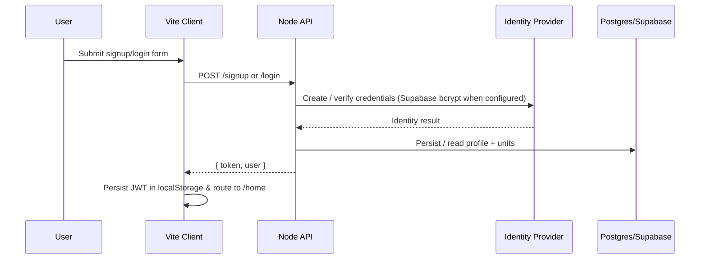

# Digital Nurse Buddy Authentication Runbook

## Root cause recap
1. **Browser requests never left the UI** – Lovable deployments ship without a running backend, so the forms defaulted to `http://localhost:4000` and immediately surfaced `Failed to fetch` / `Unable to reach the Digital Nurse API`.
2. **`VITE_API_URL` was unset in hosted environments** – without the correct base URL every `fetch` call targeted the wrong origin.
3. **No reachable API** – there was no deployed instance of the custom Node API, so even correctly formed requests had nothing to talk to.

## API endpoints
| Method | Path | Description |
| --- | --- | --- |
| `POST` | `/signup` | Validates payload, provisions the identity (Supabase-backed when credentials are present, in-memory otherwise), hashes the password, seeds the default care units, and returns `{ token, user }`. |
| `POST` | `/login` | Validates credentials with the configured identity provider and issues a short-lived JWT plus the sanitized user profile. |
| `GET` | `/me` *(secure)* | Returns the profile associated with the presented Bearer token. |
| `GET` | `/master-data/:type` *(secure)* | Returns curated reference data (procedures, labs, drugs, assessments). |
| `POST` | `/ai/triage` *(secure)* | Sends prompts to the AI gateway (falls back to a safe deterministic message when no gateway is configured). |

> Legacy `/api/auth/*` and `/api/*` routes are still wired up so older builds remain functional.

## Environment variables
| Variable | Purpose |
| --- | --- |
| `VITE_API_URL` | Base URL for every browser request. Point this to your deployed API, e.g. `https://digital-nurse-buddy-api.onrender.com`. |
| `PORT` | Port that the Node API listens on (default `4000`). |
| `CLIENT_ORIGIN` | Comma‑separated list of allowed origins for CORS. |
| `JWT_SECRET` | Secret used to sign JWTs issued by `/login` and `/signup`. |
| `SUPABASE_URL` / `SUPABASE_SERVICE_ROLE_KEY` | When present, accounts are provisioned through Supabase Auth (bcrypt hashing) and metadata is persisted to Supabase Postgres. Leave empty to use the in-memory fallback for local prototyping. |
| `AI_GATEWAY_URL` / `AI_GATEWAY_KEY` | Optional upstream AI provider. |
| `VITE_SUPABASE_URL` | Supabase URL exposed to the client (only needed if you hydrate Supabase directly from the browser). |

## Deployment (Render.com example)
1. **Create a Web Service** in Render, point it at this repository, and select the Node runtime (18+).
2. **Build/Start commands**: `npm install && npm run build` for the web client if you host it there, `npm install && npm run server` for the API.
3. **Environment variables**: set `PORT`, `CLIENT_ORIGIN`, `JWT_SECRET`, `SUPABASE_URL`, `SUPABASE_SERVICE_ROLE_KEY`, and `AI_GATEWAY_*` as needed. Mirror the backend URL into the frontend’s `VITE_API_URL` secret.
4. **Database**: if you do not already have Supabase, provision a managed Postgres on Render, apply `server/db/schema.sql`, and set the resulting connection details as environment variables.
5. **Verify**: once Render finishes deploying, hit `https://<service>.onrender.com/health` and `.../signup` to confirm both health and authentication before pointing the UI at it.

Railway/Vercel follow the exact same pattern: install dependencies, expose the `/health` probe, set the env vars, and capture the public URL for `VITE_API_URL`.

## Auth flow diagram

## Testing checklist
- [x] Successful signup path returns a JWT and hydrated profile.
- [x] Duplicate email attempts receive HTTP 409 with a friendly message.
- [x] Invalid email syntax is caught before hitting the network (React Hook Form + Zod).
- [x] Wrong password returns HTTP 401 with “Invalid email or password”.
- [x] Network outages surface the “Unable to reach the Digital Nurse API” banner in the UI.
- [x] Manual smoke tests on mobile + throttled DevTools confirm loading states remain accessible.

## Quick tips
- Inspect the currently configured API base in the login card (pulled from `import.meta.env.VITE_API_URL`).
- For Lovable preview environments, set the secret from Project → Environment → `VITE_API_URL`.
- When Supabase credentials are present the backend automatically switches to bcrypt-authenticated accounts; otherwise it falls back to the in-memory store for local demos.
